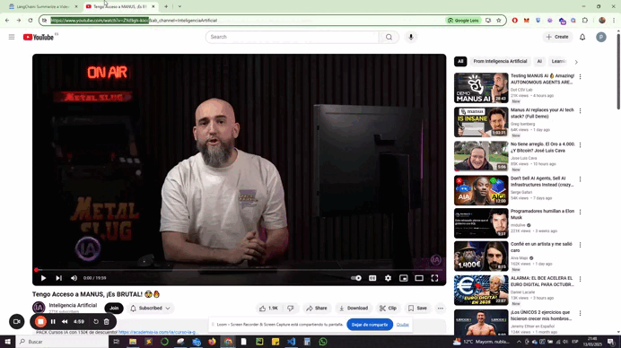

# 📺 YouTube Video Summarizer with LangChain

This project is a Streamlit app that summarizes YouTube videos using LangChain and the Groq API.

## 🚀 Features
- Extracts YouTube transcripts.
- Summarizes the content using LangChain.
- Simple UI with Streamlit.

## 🛠️ Installation
1. Clone the repository: git clone https://github.com/carfer13/YouTube-Video-Summarizer.git
2. Install dependencies: pip install -r requirements.txt
3. Run the app: streamlit run app.py

## 🖥️  Preview
